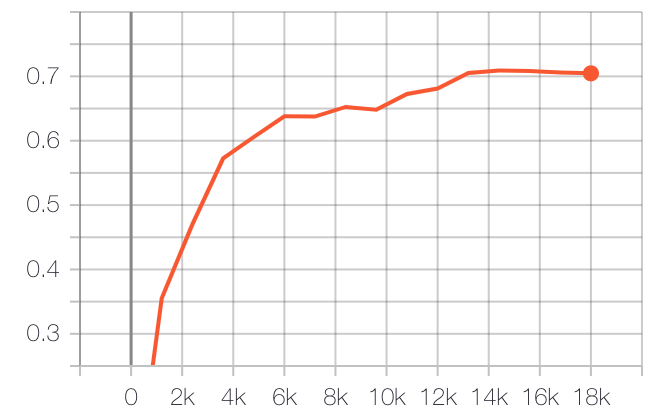

# Visual Manipulation Relationship Network

#### News! I have updated this package so that it can support pytorch 1.0 now. See branch pytorch1.0.

## Introduction
This package includes our latest proposed robotic grasping algorithms. Main framework is based on code of Faster RCNN (https://github.com/jwyang/faster-rcnn.pytorch).

Users for Pascal GPUs: you can skip the steps for building the C codes with Python because I have already done this.

Users for other GPUs: you have to follow the installation steps from https://github.com/jwyang/faster-rcnn.pytorch to make sure that the components of Faster-RCNN work fine.

## Implemented Algorithms

I have included some well-known object detection algorithms (e.g. Faster-RCNN, SSD, FPN and EfficientDet), and developed
a series of algorithms related to robotc grasping. The following figure provide an overview of this package.


In the future, I will continuously update this package so that it can contain latest SOTA algorithms and improve the 
performance of our own algorithms. Certainly, all my new works related to robotic grasping and computer vision will 
also be contained in this package.

## Installation

Since we use torchvision.ops instead of all C expansions in pytorch-1.0 version, all codes can run normally without
any extra building. Follow training example to enjoy it.

## Training Example
```bash
python main.py --dataset (DatasetName) --frame (AlgName) --net (BackboneName) --cuda
# like:
python main.py --dataset vmrdcompv1 --frame all_in_one --net res101 --cuda
```

## Testing
```bash
python main.py --test --dataset (DatasetName) --frame (AlgName) --net (BackboneName) --cuda --checkpoint (PointNum) --checkepoch (EpochNum) --GPU (GpuNum, Default:0)
#like:
python main.py --test --dataset vmrdcompv1 --frame all_in_one --net res101 --cuda --checkpoint 1000 --checkepoch 1 --GPU 0
```

## Performance

I want to re-implement the SOTA performance of the related algorithms. Some performance is shown below and it will be updated continuously.

*mAP*: mean Average Precision

*mAP-G*: mean Average Precision with Grasp Detection

*Rel-IA*: Image Accuracy of Relationship Detection

### Performance Summary

Algorithm | Backbone | Training | Testing | mAP | mAP-G | Rel-IA
|---|---|---|---|---|---|---|
Faster R-CNN | ResNet-101 | VOC2007trainval | VOC2007test | 71.5 | - | -
FPN | ResNet-101 | VOC2007trainval | VOC2007test | 73.9 | - | -
ROI-GD | ResNet-101 | VMRDtrainval | VMRDtest | 94.5 | 75.7 | -
F-VMRN | ResNet-101 | VMRDtrainval | VMRDtest | 95.6 | - | 64.7
F-VMRN | VGG-16 | VMRDtrainval | VMRDtest | 95.0 | - | 68.7

### Testing Curves

|  |
|:---:|:---:|
| Rel-IA of F-VMRN_VGG16 | Rel-IA of F-VMRN_ResNet101 |

|  |
|:---:|
| mAP of Faster-RCNN on VOC2007|

**Why Faster RCNN is not state-of-the-art:**
1. We do not apply flipping during training. When using flipping, the mAP will go up to around 73%.
2. Pytorch Pretrained model causes lower performance. Refer to: https://github.com/jwyang/faster-rcnn.pytorch/issues/60

## TODO

* [ ] Performance of SSD, S-VMRN, All-In-One
* [ ] Testing Curve of Faster-RCNN, FPN, ROI-GD
* [ ] Complete VAM model
* [ ] COCO, VisualGenome Support
* [ ] Multi-GPU Support
* [x] PyTorch 1.0 Support (see branch pytorch1.0)
* [ ] Python3 Support

## Noteable Things
1. To train the network, you have to pre-download the pretrained models and put them in "data/pretrained_model" and name them the same as the usage in codes.
2. The training data should be placed or linked in "data".
3. The code will be improved continuously. Therefore, if you meet some problems, do not hesitate to contact me.
4. The included FPN and Focal Loss are uncompleted while Faster-RCNN and SSD can be used normally, though they are not the main contributions.
5. [UPDATE in 01/04/2020] I have re-written all codes so that they can be more readable and modularized. Therefore, if you want to obtain the performance claimed in the paper,
you should check the configurations so that they are same as the claimed ones (e.g. data-augmentation methods).

## Papers
1. Zhang, Hanbo, et al. "ROI-based Robotic Grasp Detection for Object Overlapping Scenes." arXiv preprint arXiv:1808.10313 (2018). To appear in IROS 2019.
2. Zhang, Hanbo, et al. "A Multi-task Convolutional Neural Network for Autonomous Robotic Grasping in Object Stacking Scenes." arXiv preprint arXiv:1809.07081 (2018). To appear in IROS 2019.
3. Zhang, Hanbo, et al. "Visual Manipulation Relationship Network for Autonomous Robotics." 2018 IEEE-RAS 18th International Conference on Humanoid Robots (Humanoids). IEEE, 2018.
4. Zhang, Hanbo, et al. "A Real-time Robotic Grasp Approach with Oriented Anchor Box." IEEE Transactions on Systems, Man and Cybernetics: Systems. Online Early Access.
5. Zhou, Xinwen, et al. "Fully convolutional grasp detection network with oriented anchor box." 2018 IEEE/RSJ International Conference on Intelligent Robots and Systems (IROS). IEEE, 2018.
6. Ren, Shaoqing, et al. "Faster r-cnn: Towards real-time object detection with region proposal networks." Advances in neural information processing systems. 2015.
7. Liu, Wei, et al. "Ssd: Single shot multibox detector." European conference on computer vision. Springer, Cham, 2016.
8. Lin, Tsung-Yi, et al. "Focal loss for dense object detection." Proceedings of the IEEE international conference on computer vision. 2017.

## Problem Shooting

1. \[Solved\] When setting batch_size of Faster RCNN to 1 and augmentation to True, I want to use SSD-like augmentation to generate more training data. However, it will cause NaN error.
2. There are some grasp and relation label errors in VMRD. However, I find that they do not affect the detection performance much. I will fix this problem as soon as possible.
3. This package only supports pytorch 0.4.0. When using 0.4.1, there will be segmentation fault (reasons not found).
4. When training VMRN, the batchsize should be at least 2. Otherwise the network will not reach convergence.
5. All vggXX_bns cannot work well.